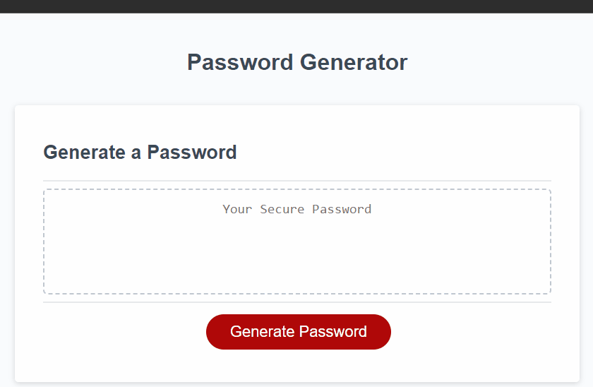

# Password Generator

This is a simple password generator web application that allows users to generate secure passwords based on their specified criteria.

## Table of Contents

- [Description](#description)
- [Files](#files)
- [Requirements](#requirements)
- [Installation](#installation)
- [Usage](#usage)
- [Live Site](#live-site)
- [Preview](#preview)

## Description

The Password Generator is a web application designed to help users generate secure passwords. It prompts users to specify the length of the password (between 8 and 128 characters) and select the types of characters they want to include (uppercase letters, lowercase letters, numbers, and special characters). Based on the user's criteria, the application generates a random password and displays it to the user.

## Files

- `index.html`: HTML file containing the structure of the web page.
- `style.css`: CSS file containing the styles for the web page.
- `script.js`: JavaScript file containing the logic for generating passwords.

## Requirements

- Web browser (e.g., Chrome, Firefox, Safari)

## Installation

1. Clone the repository:

   ```bash
   git clone https://github.com/chiiives/password-generator.git
2. Navigate to the project directory.
3. Open the index.html file in your web browser.

## Usage
1. Open the index.html file in your web browser.
2. Specify the length of the password (between 8 and 128 characters).
3. Select the types of characters you want to include in the password (uppercase letters, lowercase letters, numbers, and special characters).
4. Click the "Generate Password" button.
5. The generated password will be displayed in the text area.

## Live Site

The live version of this project can be accessed [here](https://chiiives.github.io/password-generator/)

## Preview



---

Application is developed by Jordan.

[](LICENSE)